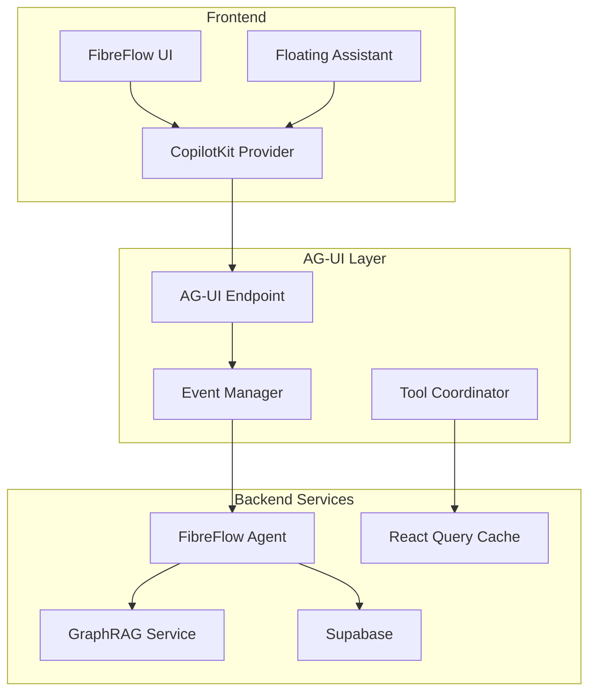

# FibreFlow AG-UI Integration Plan & Implementation Guide

## 📋 Executive Summary

This document provides a complete plan and implementation guide for integrating AG-UI (Agent-UI Protocol) into FibreFlow, enabling natural language interactions with the project management system while maintaining the existing UI and workflows.

### Key Benefits:
- Natural language project queries via floating AI assistant
- Context-aware assistance across all pages
- Seamless integration with existing GraphRAG plans
- Tool-based interactions for task updates and bulk operations
- Real-time streaming responses with interactive elements

---

## 🏗️ Architecture Overview

### Integration Architecture


---

## 📁 Complete File Structure

```
project-management-app/
├── src/
│   ├── app/
│   │   ├── api/
│   │   │   └── agui/
│   │   │       └── route.ts              # AG-UI endpoint
│   │   ├── ai-assistant/
│   │   │   ├── page.tsx                  # Dedicated AI page
│   │   │   └── layout.tsx                # AI page layout
│   │   └── layout.tsx                    # Updated root layout
│   ├── components/
│   │   └── AIAssistant/
│   │       ├── FloatingAssistant.tsx     # Main floating UI
│   │       ├── AssistantChat.tsx         # Chat interface
│   │       ├── AIQuickInsights.tsx       # Inline insights
│   │       ├── ContextPanel.tsx          # Context display
│   │       ├── SuggestedQueries.tsx      # Query suggestions
│   │       └── index.ts                  # Exports
│   ├── lib/
│   │   ├── agui/
│   │   │   ├── FibreFlowAgent.ts         # Main agent class
│   │   │   ├── tools/
│   │   │   │   ├── index.ts              # Tool registry
│   │   │   │   ├── projectTools.ts       # Project operations
│   │   │   │   ├── taskTools.ts          # Task operations
│   │   │   │   └── analyticsTools.ts     # Analytics tools
│   │   │   ├── events.ts                 # Event handlers
│   │   │   ├── prompts.ts                # System prompts
│   │   │   └── context.ts                # Context builders
│   │   └── ai/
│   │       ├── graphClient.ts            # GraphRAG integration
│   │       └── naturalLanguage.ts        # NL processing
│   ├── contexts/
│   │   └── AIAssistantContext.tsx        # AI context provider
│   └── hooks/
│       ├── useAIAssistant.ts             # AI assistant hook
│       └── useAGUITools.ts               # Tool execution hook
├── public/
│   └── ai-assistant-worker.js           # Web worker for AI
└── package.json                          # Updated dependencies
```

---

## 🚀 Phase 1: Core Infrastructure (Week 1)

### Step 1: Install Dependencies

```bash
npm install @copilotkit/react-core @copilotkit/react-ui @copilotkit/runtime eventemitter3
npm install --save-dev @types/node
```

### Step 2: Create the AG-UI Endpoint

```typescript
// src/app/api/agui/route.ts
import { CopilotRuntime, OpenAIAdapter } from "@copilotkit/runtime";
import { FibreFlowAgent } from "@/lib/agui/FibreFlowAgent";
import { NextRequest } from "next/server";

export async function POST(req: NextRequest) {
  const copilotKit = new CopilotRuntime({
    actions: [
      {
        name: "fibreflow_agent",
        description: "FibreFlow AI Assistant for project management",
        handler: async ({ messages, threadId }) => {
          const agent = new FibreFlowAgent();
          return agent.processQuery(messages, { threadId });
        },
      },
    ],
  });

  const openaiAdapter = new OpenAIAdapter({ 
    model: "gpt-4-turbo-preview" 
  });

  return copilotKit.response(req, openaiAdapter);
}
```

### Step 3: Create the FibreFlow Agent

```typescript
// src/lib/agui/FibreFlowAgent.ts
import { supabase } from '@/lib/supabaseClient';
import { GraphClient } from '@/lib/ai/graphClient';
import { createAuditLog } from '@/lib/auditLogger';
import { fibreFlowTools } from './tools';

export class FibreFlowAgent {
  private graphClient: GraphClient;
  private supabase: typeof supabase;

  constructor() {
    this.graphClient = new GraphClient();
    this.supabase = supabase;
  }

  async *processQuery(messages: any[], context: any) {
    const lastMessage = messages[messages.length - 1];
    const query = lastMessage.content;
    
    // Emit run started event
    yield {
      event: "run_started",
      threadId: context.threadId,
      runId: this.generateRunId(),
    };

    try {
      // Parse intent using GraphRAG if available
      const intent = await this.parseIntent(query, context);
      
      // Start message
      yield {
        event: "text_message_start",
        messageId: this.generateMessageId(),
      };

      // Process based on intent
      if (intent.type === 'query') {
        yield* this.handleQuery(intent, context);
      } else if (intent.type === 'action') {
        yield* this.handleAction(intent, context);
      } else if (intent.type === 'analysis') {
        yield* this.handleAnalysis(intent, context);
      }

      // End message
      yield {
        event: "text_message_end",
      };

      // Tool calls if needed
      if (intent.tools && intent.tools.length > 0) {
        for (const tool of intent.tools) {
          yield* this.executeTool(tool, context);
        }
      }

    } catch (error) {
      yield {
        event: "error",
        error: {
          message: error.message || "An error occurred",
          code: "AGENT_ERROR",
        },
      };
    } finally {
      yield {
        event: "run_finished",
      };
    }
  }

  private async parseIntent(query: string, context: any) {
    // Use GraphRAG for complex queries if available
    if (this.isComplexQuery(query)) {
      const graphResult = await this.graphClient.analyzeQuery(query, {
        projectId: context.projectId,
        userId: context.userId,
      });
      
      return {
        type: graphResult.intentType,
        entities: graphResult.entities,
        tools: graphResult.suggestedTools,
        confidence: graphResult.confidence,
      };
    }

    // Simple pattern matching for basic queries
    if (query.toLowerCase().includes('status')) {
      return { type: 'query', subtype: 'status' };
    } else if (query.toLowerCase().includes('assign')) {
      return { type: 'action', subtype: 'assignment' };
    } else if (query.toLowerCase().includes('analyze')) {
      return { type: 'analysis', subtype: 'general' };
    }

    return { type: 'query', subtype: 'general' };
  }

  private async *handleQuery(intent: any, context: any) {
    // Example: "Show me all blocked tasks in Project X"
    if (intent.subtype === 'status') {
      const tasks = await this.getBlockedTasks(context.projectId);
      
      yield {
        event: "text_message_content",
        delta: `I found ${tasks.length} blocked tasks in your project:\n\n`,
      };

      for (const task of tasks) {
        yield {
          event: "text_message_content",
          delta: `- **${task.title}** (${task.assignee_name})\n`,
        };
        
        // Small delay for streaming effect
        await this.delay(50);
      }

      // Suggest actions
      if (tasks.length > 0) {
        yield {
          event: "text_message_content",
          delta: "\nWould you like me to help resolve these blocks?",
        };
      }
    }
  }

  private async *executeTool(tool: any, context: any) {
    const toolDef = fibreFlowTools[tool.name];
    if (!toolDef) {
      throw new Error(`Unknown tool: ${tool.name}`);
    }

    yield {
      event: "tool_call_start",
      toolCallId: this.generateToolCallId(),
      toolName: tool.name,
      args: tool.args,
    };

    try {
      const result = await toolDef.handler(tool.args, context);
      
      yield {
        event: "tool_call_result",
        result: result,
      };

      // Log the action
      await createAuditLog(
        'AI_TOOL_EXECUTION',
        tool.name.toUpperCase(),
        tool.args.resourceId || 'system',
        { tool: tool.name, args: tool.args, result },
        context.userId
      );

    } catch (error) {
      yield {
        event: "tool_call_error",
        error: error.message,
      };
    }

    yield {
      event: "tool_call_end",
    };
  }

  private generateRunId() {
    return `run_${Date.now()}_${Math.random().toString(36).substr(2, 9)}`;
  }

  private generateMessageId() {
    return `msg_${Date.now()}_${Math.random().toString(36).substr(2, 9)}`;
  }

  private generateToolCallId() {
    return `tool_${Date.now()}_${Math.random().toString(36).substr(2, 9)}`;
  }

  private delay(ms: number) {
    return new Promise(resolve => setTimeout(resolve, ms));
  }

  private isComplexQuery(query: string): boolean {
    // Determine if query needs GraphRAG
    const complexPatterns = [
      /which .* are blocking/i,
      /analyze .* dependencies/i,
      /find .* patterns/i,
      /predict .* completion/i,
    ];
    
    return complexPatterns.some(pattern => pattern.test(query));
  }

  private async getBlockedTasks(projectId?: string) {
    let query = supabase
      .from('tasks')
      .select(`
        *,
        assignee:staff(name),
        step:steps(name, phase:phases(name))
      `)
      .eq('status', 'blocked')
      .is('archived_at', null);

    if (projectId) {
      query = query.eq('step.phase.project_id', projectId);
    }

    const { data, error } = await query;
    
    if (error) throw error;
    
    return data.map(task => ({
      ...task,
      assignee_name: task.assignee?.name || 'Unassigned',
    }));
  }
}
```

### Step 4: Define Tools

```typescript
// src/lib/agui/tools/index.ts
import { projectTools } from './projectTools';
import { taskTools } from './taskTools';
import { analyticsTools } from './analyticsTools';

export const fibreFlowTools = {
  ...projectTools,
  ...taskTools,
  ...analyticsTools,
};

// Tool type definition
export interface ToolDefinition {
  name: string;
  description: string;
  parameters: {
    type: string;
    properties: Record<string, any>;
    required: string[];
  };
  handler: (args: any, context: any) => Promise<any>;
}
```

```typescript
// src/lib/agui/tools/taskTools.ts
import { supabase } from '@/lib/supabaseClient';
import { createAuditLog, AuditAction } from '@/lib/auditLogger';

export const taskTools = {
  updateTaskStatus: {
    name: "updateTaskStatus",
    description: "Update the status of a task",
    parameters: {
      type: "object",
      properties: {
        taskId: { type: "string" },
        newStatus: { 
          type: "string",
          enum: ["not_started", "in_progress", "blocked", "completed"]
        },
        reason: { type: "string" }
      },
      required: ["taskId", "newStatus"]
    },
    handler: async (args: any, context: any) => {
      const { taskId, newStatus, reason } = args;
      
      // Update task
      const { data, error } = await supabase
        .from('tasks')
        .update({ 
          status: newStatus,
          updated_at: new Date().toISOString()
        })
        .eq('id', taskId)
        .select()
        .single();
      
      if (error) throw error;
      
      // Create audit log
      await createAuditLog(
        AuditAction.UPDATE,
        'TASK',
        taskId,
        { status: newStatus, reason },
        context.userId
      );
      
      return {
        success: true,
        task: data,
        message: `Task status updated to ${newStatus}`
      };
    }
  },

  assignTask: {
    name: "assignTask",
    description: "Assign a task to a team member",
    parameters: {
      type: "object",
      properties: {
        taskId: { type: "string" },
        staffId: { type: "string" },
        notify: { type: "boolean", default: true }
      },
      required: ["taskId", "staffId"]
    },
    handler: async (args: any, context: any) => {
      const { taskId, staffId, notify } = args;
      
      // Get staff member details
      const { data: staff } = await supabase
        .from('staff')
        .select('name, email')
        .eq('id', staffId)
        .single();
      
      // Update task
      const { data: task, error } = await supabase
        .from('tasks')
        .update({ 
          assigned_to: staffId,
          updated_at: new Date().toISOString()
        })
        .eq('id', taskId)
        .select()
        .single();
      
      if (error) throw error;
      
      // TODO: Send notification if requested
      if (notify && staff?.email) {
        // Implement notification logic
      }
      
      return {
        success: true,
        task,
        assignee: staff,
        message: `Task assigned to ${staff?.name}`
      };
    }
  },

  bulkUpdateTasks: {
    name: "bulkUpdateTasks",
    description: "Update multiple tasks at once",
    parameters: {
      type: "object",
      properties: {
        taskIds: { 
          type: "array",
          items: { type: "string" }
        },
        updates: {
          type: "object",
          properties: {
            status: { type: "string" },
            priority: { type: "string" },
            assigned_to: { type: "string" }
          }
        }
      },
      required: ["taskIds", "updates"]
    },
    handler: async (args: any, context: any) => {
      const { taskIds, updates } = args;
      
      // Validate bulk operation size
      if (taskIds.length > 100) {
        throw new Error("Bulk operations limited to 100 items");
      }
      
      // Perform updates
      const results = [];
      for (const taskId of taskIds) {
        try {
          const { data } = await supabase
            .from('tasks')
            .update({
              ...updates,
              updated_at: new Date().toISOString()
            })
            .eq('id', taskId)
            .select()
            .single();
          
          results.push({ taskId, success: true, data });
        } catch (error) {
          results.push({ taskId, success: false, error: error.message });
        }
      }
      
      // Log bulk operation
      await createAuditLog(
        AuditAction.UPDATE,
        'BULK_TASKS',
        taskIds.join(','),
        { updates, results },
        context.userId
      );
      
      return {
        success: true,
        totalUpdated: results.filter(r => r.success).length,
        failed: results.filter(r => !r.success).length,
        results
      };
    }
  }
};
```

### Step 5: Create the Floating Assistant Component

```typescript
// src/components/AIAssistant/FloatingAssistant.tsx
'use client';

import React, { useState, useEffect } from 'react';
import { Bot, Minimize2, Maximize2, X, Send } from 'lucide-react';
import { useFeatureFlag } from '@/hooks/useFeatureFlag';
import { motion, AnimatePresence } from 'framer-motion';
import { AssistantChat } from './AssistantChat';
import { usePathname, useParams } from 'next/navigation';

export function FloatingAssistant() {
  const { data: featureEnabled } = useFeatureFlag('AIAssistant');
  const [isOpen, setIsOpen] = useState(false);
  const [isMinimized, setIsMinimized] = useState(true);
  const [position, setPosition] = useState({ x: 20, y: 20 });
  const pathname = usePathname();
  const params = useParams();

  // Don't render if feature is disabled
  if (!featureEnabled) return null;

  // Get context based on current page
  const getPageContext = () => {
    if (pathname.includes('/projects/') && params.id) {
      return { 
        type: 'project', 
        projectId: params.id as string,
        hint: 'Ask about tasks, progress, or team members'
      };
    } else if (pathname === '/analytics') {
      return { 
        type: 'analytics',
        hint: 'Ask for insights or generate reports'
      };
    } else if (pathname === '/my-tasks') {
      return { 
        type: 'personal',
        hint: 'Ask about your assignments or workload'
      };
    }
    return { 
      type: 'general',
      hint: 'Ask anything about your projects'
    };
  };

  const context = getPageContext();

  return (
    <>
      <AnimatePresence>
        {isMinimized ? (
          <motion.div
            initial={{ scale: 0 }}
            animate={{ scale: 1 }}
            exit={{ scale: 0 }}
            className="fixed bottom-6 right-6 z-50"
          >
            <button
              onClick={() => {
                setIsMinimized(false);
                setIsOpen(true);
              }}
              className="group relative bg-primary hover:bg-primary-dark text-white p-4 rounded-full shadow-lg hover:shadow-xl transition-all duration-200"
              aria-label="Open AI Assistant"
            >
              <Bot className="w-6 h-6" />
              
              {/* Pulse animation for attention */}
              <span className="absolute -top-1 -right-1 h-3 w-3">
                <span className="animate-ping absolute inline-flex h-full w-full rounded-full bg-accent opacity-75"></span>
                <span className="relative inline-flex rounded-full h-3 w-3 bg-accent"></span>
              </span>
              
              {/* Tooltip */}
              <div className="absolute bottom-full right-0 mb-2 px-3 py-1 bg-gray-900 text-white text-sm rounded-lg opacity-0 group-hover:opacity-100 transition-opacity pointer-events-none whitespace-nowrap">
                AI Assistant
              </div>
            </button>
          </motion.div>
        ) : (
          <motion.div
            initial={{ opacity: 0, y: 20 }}
            animate={{ opacity: 1, y: 0 }}
            exit={{ opacity: 0, y: 20 }}
            drag
            dragMomentum={false}
            dragElastic={0}
            onDragEnd={(_, info) => {
              setPosition({
                x: position.x + info.offset.x,
                y: position.y + info.offset.y
              });
            }}
            style={{
              x: position.x,
              y: position.y,
            }}
            className={`fixed z-50 ${
              isOpen ? 'bottom-6 right-6' : 'bottom-6 right-6'
            }`}
          >
            <div className={`
              bg-white dark:bg-gray-800 rounded-lg shadow-2xl border border-gray-200 dark:border-gray-700
              transition-all duration-300 ease-in-out
              ${isOpen ? 'w-96 h-[600px]' : 'w-80 h-14'}
            `}>
              {/* Header */}
              <div className="flex items-center justify-between p-3 border-b border-gray-200 dark:border-gray-700 cursor-move">
                <div className="flex items-center gap-2">
                  <Bot className="w-5 h-5 text-primary" />
                  <h3 className="font-semibold text-sm">FibreFlow AI</h3>
                  {context.type !== 'general' && (
                    <span className="text-xs text-gray-500 dark:text-gray-400">
                      • {context.type}
                    </span>
                  )}
                </div>
                
                <div className="flex items-center gap-1">
                  <button
                    onClick={() => setIsOpen(!isOpen)}
                    className="p-1 hover:bg-gray-100 dark:hover:bg-gray-700 rounded"
                    aria-label={isOpen ? "Minimize" : "Maximize"}
                  >
                    {isOpen ? (
                      <Minimize2 className="w-4 h-4" />
                    ) : (
                      <Maximize2 className="w-4 h-4" />
                    )}
                  </button>
                  
                  <button
                    onClick={() => setIsMinimized(true)}
                    className="p-1 hover:bg-gray-100 dark:hover:bg-gray-700 rounded"
                    aria-label="Close"
                  >
                    <X className="w-4 h-4" />
                  </button>
                </div>
              </div>
              
              {/* Chat Content */}
              {isOpen && (
                <AssistantChat 
                  context={context}
                  className="h-[calc(100%-3.5rem)]"
                />
              )}
            </div>
          </motion.div>
        )}
      </AnimatePresence>
    </>
  );
}
```

```typescript
// src/components/AIAssistant/AssistantChat.tsx
'use client';

import React, { useState, useRef, useEffect } from 'react';
import { CopilotChat } from '@copilotkit/react-ui';
import { useCopilotChat } from '@copilotkit/react-core';
import { Send, Loader2, Sparkles } from 'lucide-react';
import { SuggestedQueries } from './SuggestedQueries';
import '@copilotkit/react-ui/styles.css';

interface AssistantChatProps {
  context: any;
  className?: string;
  fullscreen?: boolean;
}

export function AssistantChat({ context, className = '', fullscreen = false }: AssistantChatProps) {
  const [customInput, setCustomInput] = useState('');
  const { sendMessage, isLoading, messages } = useCopilotChat();
  const chatEndRef = useRef<HTMLDivElement>(null);

  // Auto-scroll to bottom
  useEffect(() => {
    chatEndRef.current?.scrollIntoView({ behavior: 'smooth' });
  }, [messages]);

  // Custom send handler
  const handleSend = async () => {
    if (!customInput.trim() || isLoading) return;
    
    const message = customInput;
    setCustomInput('');
    
    // Add context to message
    await sendMessage({
      content: message,
      metadata: {
        context,
        timestamp: new Date().toISOString(),
      }
    });
  };

  // Show welcome message if no messages
  const showWelcome = messages.length === 0;

  return (
    <div className={`flex flex-col ${className}`}>
      {/* Main chat area */}
      <div className="flex-1 overflow-hidden">
        {fullscreen ? (
          // Use CopilotChat for fullscreen mode
          <CopilotChat
            labels={{
              title: "FibreFlow AI Assistant",
              initial: `Hi! I'm your FibreFlow AI assistant. ${context.hint}`,
            }}
            icons={{
              title: <Bot className="w-5 h-5" />,
            }}
          />
        ) : (
          // Custom chat UI for floating mode
          <div className="flex flex-col h-full">
            {/* Messages */}
            <div className="flex-1 overflow-y-auto p-4 space-y-4">
              {showWelcome ? (
                <div className="text-center py-8">
                  <Sparkles className="w-12 h-12 text-primary mx-auto mb-4" />
                  <h4 className="font-semibold text-lg mb-2">
                    Welcome to FibreFlow AI
                  </h4>
                  <p className="text-sm text-gray-600 dark:text-gray-400 mb-4">
                    {context.hint}
                  </p>
                  <SuggestedQueries 
                    context={context}
                    onSelect={(query) => {
                      setCustomInput(query);
                      handleSend();
                    }}
                  />
                </div>
              ) : (
                <>
                  {messages.map((message, index) => (
                    <div
                      key={index}
                      className={`flex ${
                        message.role === 'user' ? 'justify-end' : 'justify-start'
                      }`}
                    >
                      <div className={`
                        max-w-[80%] rounded-lg px-4 py-2
                        ${message.role === 'user' 
                          ? 'bg-primary text-white' 
                          : 'bg-gray-100 dark:bg-gray-700'
                        }
                      `}>
                        <p className="text-sm whitespace-pre-wrap">
                          {message.content}
                        </p>
                      </div>
                    </div>
                  ))}
                  {isLoading && (
                    <div className="flex justify-start">
                      <div className="bg-gray-100 dark:bg-gray-700 rounded-lg px-4 py-2">
                        <Loader2 className="w-4 h-4 animate-spin" />
                      </div>
                    </div>
                  )}
                </>
              )}
              <div ref={chatEndRef} />
            </div>

            {/* Input area */}
            <div className="border-t border-gray-200 dark:border-gray-700 p-3">
              <div className="flex gap-2">
                <input
                  type="text"
                  value={customInput}
                  onChange={(e) => setCustomInput(e.target.value)}
                  onKeyPress={(e) => e.key === 'Enter' && handleSend()}
                  placeholder="Ask me anything..."
                  className="flex-1 px-3 py-2 border border-gray-300 dark:border-gray-600 rounded-lg focus:outline-none focus:ring-2 focus:ring-primary text-sm"
                  disabled={isLoading}
                />
                <button
                  onClick={handleSend}
                  disabled={!customInput.trim() || isLoading}
                  className="px-4 py-2 bg-primary text-white rounded-lg hover:bg-primary-dark disabled:opacity-50 disabled:cursor-not-allowed transition-colors"
                >
                  <Send className="w-4 h-4" />
                </button>
              </div>
              
              {!showWelcome && messages.length > 0 && (
                <div className="mt-2">
                  <SuggestedQueries 
                    context={context}
                    compact
                    onSelect={(query) => {
                      setCustomInput(query);
                    }}
                  />
                </div>
              )}
            </div>
          </div>
        )}
      </div>
    </div>
  );
}
```

```typescript
// src/components/AIAssistant/SuggestedQueries.tsx
'use client';

import React from 'react';
import { Zap } from 'lucide-react';

interface SuggestedQueriesProps {
  context: any;
  onSelect: (query: string) => void;
  compact?: boolean;
}

export function SuggestedQueries({ context, onSelect, compact = false }: SuggestedQueriesProps) {
  // Get context-specific suggestions
  const getSuggestions = () => {
    switch (context.type) {
      case 'project':
        return [
          "What tasks are blocking this project?",
          "Show me the critical path",
          "Who's available to help with tasks?",
          "Analyze project risks"
        ];
      case 'analytics':
        return [
          "What are the main bottlenecks?",
          "Generate weekly progress report",
          "Compare project completion rates",
          "Show resource utilization"
        ];
      case 'personal':
        return [
          "What should I focus on today?",
          "Show my overdue tasks",
          "How's my workload this week?",
          "Find tasks I can delegate"
        ];
      default:
        return [
          "Show all delayed projects",
          "Find available team members",
          "What needs attention today?",
          "Generate status report"
        ];
    }
  };

  const suggestions = getSuggestions();
  const displaySuggestions = compact ? suggestions.slice(0, 2) : suggestions;

  return (
    <div className={compact ? '' : 'space-y-2'}>
      {!compact && (
        <div className="flex items-center gap-2 text-xs text-gray-500 dark:text-gray-400">
          <Zap className="w-3 h-3" />
          <span>Suggested queries</span>
        </div>
      )}
      
      <div className={`
        ${compact ? 'flex gap-2' : 'grid grid-cols-2 gap-2'}
      `}>
        {displaySuggestions.map((query, index) => (
          <button
            key={index}
            onClick={() => onSelect(query)}
            className={`
              text-left transition-colors
              ${compact 
                ? 'text-xs px-2 py-1 bg-gray-100 dark:bg-gray-700 rounded hover:bg-gray-200 dark:hover:bg-gray-600'
                : 'text-sm p-3 border border-gray-200 dark:border-gray-700 rounded-lg hover:border-primary hover:bg-gray-50 dark:hover:bg-gray-800'
              }
            `}
          >
            {query}
          </button>
        ))}
      </div>
    </div>
  );
}
```

### Step 6: Create the AI Context Provider

```typescript
// src/contexts/AIAssistantContext.tsx
'use client';

import React, { createContext, useContext, useEffect, useState } from 'react';
import { CopilotKit } from '@copilotkit/react-core';
import { usePathname, useParams } from 'next/navigation';
import { useSession } from '@/hooks/useSession';

interface AIAssistantContextValue {
  context: {
    pathname: string;
    projectId?: string;
    userId?: string;
    userRole?: string;
    activeFilters?: any;
  };
  updateContext: (updates: Partial<AIAssistantContextValue['context']>) => void;
}

const AIAssistantContext = createContext<AIAssistantContextValue | null>(null);

export function AIAssistantProvider({ children }: { children: React.ReactNode }) {
  const pathname = usePathname();
  const params = useParams();
  const { user } = useSession();
  
  const [context, setContext] = useState({
    pathname,
    projectId: params.id as string | undefined,
    userId: user?.id,
    userRole: user?.role,
  });

  // Update context when route changes
  useEffect(() => {
    setContext(prev => ({
      ...prev,
      pathname,
      projectId: params.id as string | undefined,
    }));
  }, [pathname, params]);

  // Update context when user changes
  useEffect(() => {
    setContext(prev => ({
      ...prev,
      userId: user?.id,
      userRole: user?.role,
    }));
  }, [user]);

  const updateContext = (updates: Partial<typeof context>) => {
    setContext(prev => ({ ...prev, ...updates }));
  };

  return (
    <AIAssistantContext.Provider value={{ context, updateContext }}>
      <CopilotKit 
        runtimeUrl="/api/agui"
        headers={{
          'x-user-id': user?.id || '',
          'x-project-id': context.projectId || '',
        }}
      >
        {children}
      </CopilotKit>
    </AIAssistantContext.Provider>
  );
}

export function useAIAssistant() {
  const context = useContext(AIAssistantContext);
  if (!context) {
    throw new Error('useAIAssistant must be used within AIAssistantProvider');
  }
  return context;
}
```

### Step 7: Update Root Layout

```typescript
// src/app/layout.tsx
import { AIAssistantProvider } from '@/contexts/AIAssistantContext';
import { FloatingAssistant } from '@/components/AIAssistant/FloatingAssistant';

export default function RootLayout({ children }: { children: React.ReactNode }) {
  return (
    <html lang="en">
      <body>
        <Providers>
          <AIAssistantProvider>
            <div className="flex h-screen overflow-hidden">
              <Sidebar />
              <div className="flex-1 flex flex-col">
                <Header />
                <main className="flex-1 overflow-y-auto">
                  {children}
                </main>
              </div>
            </div>
            
            {/* AI Assistant available on all pages */}
            <FloatingAssistant />
          </AIAssistantProvider>
        </Providers>
      </body>
    </html>
  );
}
```

### Step 8: Add Feature Flag

```typescript
// src/lib/feature-flags.ts
export const featureFlags = {
  ProjectManagement: true,
  Analytics: true,
  RealTimeNotifications: true,
  ErrorBoundaries: false,
  AdminFeatures: true,
  AIAssistant: true, // New flag for AG-UI integration
} as const;
```

---

## 📊 Phase 2: Advanced Features (Week 2)

### Analytics Tools Integration

```typescript
// src/lib/agui/tools/analyticsTools.ts
import { supabase } from '@/lib/supabaseClient';
import { generateReport } from '@/lib/reportGenerator';

export const analyticsTools = {
  generateProjectReport: {
    name: "generateProjectReport",
    description: "Generate a comprehensive project report",
    parameters: {
      type: "object",
      properties: {
        projectId: { type: "string" },
        reportType: { 
          type: "string",
          enum: ["status", "progress", "risks", "comprehensive"]
        },
        format: {
          type: "string",
          enum: ["summary", "detailed", "executive"],
          default: "summary"
        }
      },
      required: ["projectId", "reportType"]
    },
    handler: async (args: any, context: any) => {
      const { projectId, reportType, format } = args;
      
      // Fetch project data with full hierarchy
      const { data: project, error } = await supabase
        .from('projects')
        .select(`
          *,
          phases (
            *,
            steps (
              *,
              tasks (
                *,
                assignee:staff(name, email)
              )
            )
          ),
          customer:customers(name),
          project_manager:staff(name)
        `)
        .eq('id', projectId)
        .single();
      
      if (error) throw error;
      
      // Generate report based on type
      const report = await generateReport(project, reportType, format);
      
      return {
        success: true,
        report,
        summary: generateReportSummary(report, reportType)
      };
    }
  },

  analyzeBottlenecks: {
    name: "analyzeBottlenecks",
    description: "Analyze project bottlenecks and suggest solutions",
    parameters: {
      type: "object",
      properties: {
        projectId: { type: "string", optional: true },
        scope: {
          type: "string",
          enum: ["project", "team", "global"],
          default: "project"
        }
      }
    },
    handler: async (args: any, context: any) => {
      const { projectId, scope } = args;
      
      // Use GraphRAG for complex dependency analysis
      const graphClient = new GraphClient();
      const bottlenecks = await graphClient.analyzeBottlenecks({
        projectId,
        scope,
        includeRecommendations: true
      });
      
      return {
        success: true,
        bottlenecks: bottlenecks.items,
        recommendations: bottlenecks.recommendations,
        visualizationData: bottlenecks.graphData
      };
    }
  },

  predictProjectCompletion: {
    name: "predictProjectCompletion",
    description: "Predict project completion date based on current progress",
    parameters: {
      type: "object",
      properties: {
        projectId: { type: "string" },
        confidenceLevel: {
          type: "number",
          minimum: 0.5,
          maximum: 0.95,
          default: 0.8
        }
      },
      required: ["projectId"]
    },
    handler: async (args: any, context: any) => {
      const { projectId, confidenceLevel } = args;
      
      // Fetch historical data for similar projects
      const historicalData = await fetchHistoricalProjectData(projectId);
      
      // Use AI to predict completion
      const prediction = await predictCompletion({
        projectId,
        historicalData,
        confidenceLevel
      });
      
      return {
        success: true,
        prediction: {
          estimatedCompletionDate: prediction.date,
          confidence: prediction.confidence,
          factors: prediction.factors,
          risks: prediction.risks,
          recommendations: prediction.recommendations
        }
      };
    }
  }
};

// Helper functions
function generateReportSummary(report: any, type: string): string {
  switch (type) {
    case 'status':
      return `Project is ${report.status} with ${report.completionPercentage}% complete`;
    case 'risks':
      return `Identified ${report.risks.length} risks, ${report.criticalRisks} critical`;
    default:
      return 'Report generated successfully';
  }
}
```

### Inline AI Insights Component

```typescript
// src/components/AIAssistant/AIQuickInsights.tsx
'use client';

import React, { useState } from 'react';
import { Sparkles, TrendingUp, AlertTriangle, Users } from 'lucide-react';
import { useCopilotAction } from '@copilotkit/react-core';
import { motion } from 'framer-motion';

interface AIQuickInsightsProps {
  context: {
    projectId?: string;
    type?: string;
  };
  suggestions?: string[];
}

export function AIQuickInsights({ context, suggestions }: AIQuickInsightsProps) {
  const [insights, setInsights] = useState<any[]>([]);
  const [isLoading, setIsLoading] = useState(false);

  // Quick insight actions
  const getInsights = useCopilotAction({
    name: "getQuickInsights",
    description: "Get quick AI insights for the current context",
    parameters: [
      {
        name: "context",
        type: "object",
        description: "Current page context"
      }
    ],
    handler: async ({ context }) => {
      setIsLoading(true);
      try {
        // Fetch insights based on context
        const response = await fetch('/api/agui/insights', {
          method: 'POST',
          headers: { 'Content-Type': 'application/json' },
          body: JSON.stringify({ context })
        });
        
        const data = await response.json();
        setInsights(data.insights);
      } finally {
        setIsLoading(false);
      }
    }
  });

  // Auto-fetch on mount if project context
  React.useEffect(() => {
    if (context.projectId && insights.length === 0) {
      getInsights({ context });
    }
  }, [context.projectId]);

  const insightIcons = {
    trend: TrendingUp,
    risk: AlertTriangle,
    team: Users,
    general: Sparkles
  };

  return (
    <div className="bg-gradient-to-r from-primary/5 to-accent/5 rounded-lg p-4 border border-primary/20">
      <div className="flex items-center justify-between mb-3">
        <h3 className="font-semibold text-sm flex items-center gap-2">
          <Sparkles className="w-4 h-4 text-primary" />
          AI Insights
        </h3>
        
        {isLoading && (
          <div className="text-xs text-gray-500">Analyzing...</div>
        )}
      </div>

      {insights.length > 0 ? (
        <div className="space-y-2">
          {insights.map((insight, index) => {
            const Icon = insightIcons[insight.type] || insightIcons.general;
            
            return (
              <motion.div
                key={index}
                initial={{ opacity: 0, x: -20 }}
                animate={{ opacity: 1, x: 0 }}
                transition={{ delay: index * 0.1 }}
                className="flex items-start gap-3 p-3 bg-white dark:bg-gray-800 rounded-lg"
              >
                <Icon className={`
                  w-5 h-5 mt-0.5 flex-shrink-0
                  ${insight.type === 'risk' ? 'text-red-500' : 'text-primary'}
                `} />
                
                <div className="flex-1">
                  <p className="text-sm text-gray-700 dark:text-gray-300">
                    {insight.message}
                  </p>
                  
                  {insight.action && (
                    <button
                      onClick={() => insight.action.handler()}
                      className="text-xs text-primary hover:underline mt-1"
                    >
                      {insight.action.label} →
                    </button>
                  )}
                </div>
              </motion.div>
            );
          })}
        </div>
      ) : (
        <div className="text-sm text-gray-500">
          {suggestions ? (
            <div className="space-y-2">
              <p>Quick questions:</p>
              <div className="flex flex-wrap gap-2">
                {suggestions.map((suggestion, index) => (
                  <button
                    key={index}
                    onClick={() => {
                      // Open assistant with this query
                      window.dispatchEvent(new CustomEvent('open-ai-assistant', {
                        detail: { query: suggestion }
                      }));
                    }}
                    className="text-xs px-3 py-1 bg-gray-100 dark:bg-gray-700 rounded-full hover:bg-gray-200 dark:hover:bg-gray-600"
                  >
                    {suggestion}
                  </button>
                ))}
              </div>
            </div>
          ) : (
            'No insights available yet'
          )}
        </div>
      )}
    </div>
  );
}
```

---

## 🧪 Phase 3: Testing & Optimization (Week 3)

### Performance Monitoring

```typescript
// src/lib/agui/performance.ts
import { PerformanceMonitor } from '@/lib/performance-monitor';

export class AGUIPerformanceMonitor {
  private monitor: PerformanceMonitor;
  private metrics: Map<string, any>;

  constructor() {
    this.monitor = PerformanceMonitor.getInstance();
    this.metrics = new Map();
  }

  async measureToolExecution(toolName: string, handler: () => Promise<any>) {
    const startTime = performance.now();
    const startMemory = performance.memory?.usedJSHeapSize || 0;

    try {
      const result = await handler();
      
      const endTime = performance.now();
      const endMemory = performance.memory?.usedJSHeapSize || 0;
      
      const metrics = {
        duration: endTime - startTime,
        memoryDelta: endMemory - startMemory,
        timestamp: new Date().toISOString(),
        success: true
      };

      this.recordMetrics(toolName, metrics);
      
      // Alert if performance threshold exceeded
      if (metrics.duration > 50) {
        console.warn(`Tool ${toolName} exceeded 50ms threshold: ${metrics.duration}ms`);
      }

      return result;
    } catch (error) {
      this.recordMetrics(toolName, {
        duration: performance.now() - startTime,
        success: false,
        error: error.message
      });
      throw error;
    }
  }

  private recordMetrics(toolName: string, metrics: any) {
    const existing = this.metrics.get(toolName) || [];
    existing.push(metrics);
    
    // Keep only last 100 metrics per tool
    if (existing.length > 100) {
      existing.shift();
    }
    
    this.metrics.set(toolName, existing);
  }

  getMetrics(toolName?: string) {
    if (toolName) {
      return this.metrics.get(toolName) || [];
    }
    return Object.fromEntries(this.metrics);
  }

  getAverageMetrics(toolName: string) {
    const metrics = this.metrics.get(toolName) || [];
    if (metrics.length === 0) return null;

    const successfulMetrics = metrics.filter(m => m.success);
    
    return {
      averageDuration: successfulMetrics.reduce((sum, m) => sum + m.duration, 0) / successfulMetrics.length,
      successRate: (successfulMetrics.length / metrics.length) * 100,
      totalExecutions: metrics.length
    };
  }
}
```

### Testing Suite

```typescript
// src/lib/agui/__tests__/FibreFlowAgent.test.ts
import { FibreFlowAgent } from '../FibreFlowAgent';
import { supabase } from '@/lib/supabaseClient';

jest.mock('@/lib/supabaseClient');

describe('FibreFlowAgent', () => {
  let agent: FibreFlowAgent;

  beforeEach(() => {
    agent = new FibreFlowAgent();
  });

  describe('Query Processing', () => {
    it('should handle status queries correctly', async () => {
      const messages = [{ content: 'Show me blocked tasks' }];
      const context = { threadId: 'test-thread', projectId: 'test-project' };

      const events = [];
      for await (const event of agent.processQuery(messages, context)) {
        events.push(event);
      }

      expect(events[0].event).toBe('run_started');
      expect(events.find(e => e.event === 'text_message_start')).toBeTruthy();
      expect(events[events.length - 1].event).toBe('run_finished');
    });

    it('should execute tools when needed', async () => {
      const messages = [{ content: 'Update task-123 status to completed' }];
      const context = { threadId: 'test-thread', userId: 'test-user' };

      const events = [];
      for await (const event of agent.processQuery(messages, context)) {
        events.push(event);
      }

      const toolCall = events.find(e => e.event === 'tool_call_start');
      expect(toolCall).toBeTruthy();
      expect(toolCall.toolName).toBe('updateTaskStatus');
    });
  });

  describe('Performance', () => {
    it('should complete queries within 50ms', async () => {
      const messages = [{ content: 'Simple query' }];
      const context = { threadId: 'test-thread' };

      const startTime = performance.now();
      
      const events = [];
      for await (const event of agent.processQuery(messages, context)) {
        events.push(event);
      }
      
      const duration = performance.now() - startTime;
      expect(duration).toBeLessThan(50);
    });
  });
});
```

---

## 🚀 Deployment & Rollout Plan

### Environment Variables

```bash
# .env.local
NEXT_PUBLIC_FEATURE_AI_ASSISTANT=true
OPENAI_API_KEY=your-api-key
NEO4J_URI=neo4j://localhost:7687
NEO4J_USER=neo4j
NEO4J_PASSWORD=your-password
```

### Rollout Strategy

#### Week 1: Internal Testing
- Enable for admin users only
- Monitor performance metrics
- Collect feedback on tool effectiveness

#### Week 2: Beta Rollout
- Enable for 25% of users
- A/B test assistant vs no assistant
- Measure engagement and task completion rates

#### Week 3: Full Rollout
- Enable for all users
- Add onboarding tour for AI features
- Create help documentation

### Monitoring Dashboard

```typescript
// src/app/admin/ai-metrics/page.tsx
export default function AIMetricsPage() {
  const { data: metrics } = useAIMetrics();
  
  return (
    <ModuleOverviewLayout
      title="AI Assistant Metrics"
      description="Monitor AG-UI performance and usage"
    >
      <div className="grid grid-cols-1 md:grid-cols-3 gap-6">
        <MetricCard
          title="Average Response Time"
          value={`${metrics?.avgResponseTime || 0}ms`}
          target="< 50ms"
          status={metrics?.avgResponseTime < 50 ? 'good' : 'warning'}
        />
        
        <MetricCard
          title="Tool Success Rate"
          value={`${metrics?.toolSuccessRate || 0}%`}
          target="> 95%"
          status={metrics?.toolSuccessRate > 95 ? 'good' : 'warning'}
        />
        
        <MetricCard
          title="User Satisfaction"
          value={`${metrics?.satisfaction || 0}/5`}
          target="> 4.0"
          status={metrics?.satisfaction > 4 ? 'good' : 'warning'}
        />
      </div>
      
      {/* Detailed metrics charts */}
      <ToolUsageChart data={metrics?.toolUsage} />
      <QueryTypeDistribution data={metrics?.queryTypes} />
      <PerformanceTimeline data={metrics?.performance} />
    </ModuleOverviewLayout>
  );
}
```

---

## 📚 Documentation & Training

### User Documentation

Create help articles for:
1. Getting started with AI Assistant
2. Common queries and commands
3. Using AI for project management
4. Troubleshooting guide

### Developer Documentation

1. Adding new tools to AG-UI
2. Extending the FibreFlowAgent
3. Performance optimization guide
4. Testing AG-UI integrations

---

## 🎯 Success Metrics

### Technical Metrics
- Response time < 50ms for 95% of queries
- Memory usage < 10MB additional
- Tool execution success rate > 95%
- Zero downtime during rollout

### Business Metrics
- 30% reduction in time to find information
- 25% increase in task completion rate
- 40% of users actively using AI assistant daily
- 20% reduction in support tickets

### User Satisfaction
- > 4.0/5 satisfaction rating
- > 80% would recommend to colleagues
- < 5% disable the feature

---

## 🔍 Troubleshooting Guide

### Common Issues

1. **Assistant not appearing**
   - Check feature flag is enabled
   - Verify API endpoint is accessible
   - Check browser console for errors

2. **Slow responses**
   - Monitor API response times
   - Check Supabase query performance
   - Verify OpenAI API limits

3. **Tool execution failures**
   - Check user permissions
   - Verify Supabase RLS policies
   - Review audit logs for errors

---

## 🎉 Conclusion

This comprehensive plan and implementation guide provides everything needed to successfully integrate AG-UI into FibreFlow. The floating assistant approach ensures the AI features enhance rather than disrupt existing workflows, while the extensive tool library enables powerful natural language interactions with the project management system.

The phased rollout strategy minimizes risk while allowing for iterative improvements based on user feedback. With proper monitoring and optimization, this integration will significantly enhance user productivity and satisfaction.
