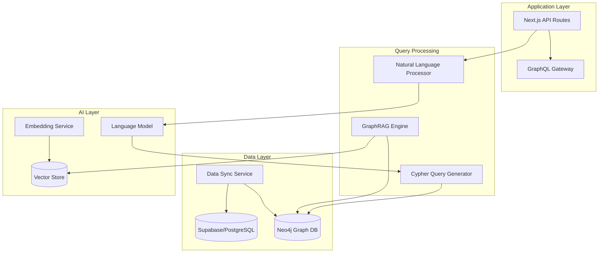

# GraphRAG/Neo4j Integration Plan

## Executive Summary

This document outlines the integration plan for implementing GraphRAG with Neo4j to enable natural language project queries and advanced dependency analysis in FibreFlow. The integration will transform FibreFlow into an AI-powered project management system capable of understanding complex relationships, predicting bottlenecks, and providing intelligent recommendations.

## Table of Contents

1. [Overview](#overview)
2. [Architecture Design](#architecture-design)
3. [Graph Data Model](#graph-data-model)
4. [GraphRAG Implementation](#graphrag-implementation)
5. [Natural Language Query System](#natural-language-query-system)
6. [Dependency Analysis Features](#dependency-analysis-features)
7. [Integration Approach](#integration-approach)
8. [Performance Considerations](#performance-considerations)
9. [Security & Access Control](#security--access-control)
10. [Implementation Phases](#implementation-phases)
11. [Success Metrics](#success-metrics)

## Overview

### Goals
- Enable natural language queries for project insights
- Analyze complex dependency chains across projects
- Identify patterns and predict bottlenecks
- Provide AI-powered recommendations for resource allocation
- Visualize risk propagation through project networks

### Key Technologies
- **Neo4j**: Graph database for relationship storage and traversal
- **GraphRAG**: Retrieval-Augmented Generation for graph-based queries
- **LangChain**: LLM orchestration for natural language processing
- **OpenAI/Anthropic APIs**: Language models for query understanding
- **Apache Kafka**: Real-time data synchronization

## Architecture Design

### Hybrid Database Architecture



### Component Responsibilities

1. **Supabase (PostgreSQL)**: Primary transactional database
2. **Neo4j**: Graph analytics and relationship queries
3. **GraphRAG Engine**: Combines graph traversal with LLM reasoning
4. **Vector Store**: Stores embeddings for semantic search
5. **Sync Service**: Maintains consistency between databases

## Graph Data Model

### Core Entities and Relationships

```cypher
// Projects and Structure
(p:Project {
    id: UUID,
    name: STRING,
    status: STRING,
    created_at: TIMESTAMP,
    completion_rate: FLOAT,
    risk_score: FLOAT
})

(ph:Phase {
    id: UUID,
    name: STRING,
    order: INTEGER,
    duration_days: INTEGER,
    critical_path: BOOLEAN
})

(s:Step {
    id: UUID,
    name: STRING,
    estimated_hours: FLOAT,
    actual_hours: FLOAT
})

(t:Task {
    id: UUID,
    title: STRING,
    priority: STRING,
    status: STRING,
    due_date: DATE,
    completion_time: FLOAT
})

// People and Resources
(st:Staff {
    id: UUID,
    name: STRING,
    role: STRING,
    skills: [STRING],
    efficiency_score: FLOAT
})

(e:Equipment {
    id: UUID,
    name: STRING,
    type: STRING,
    availability: BOOLEAN
})

// Issues and Risks
(i:Issue {
    id: UUID,
    title: STRING,
    severity: STRING,
    resolution_time: FLOAT
})

// Relationships
(p)-[:HAS_PHASE {order: INTEGER}]->(ph)
(ph)-[:CONTAINS_STEP {sequence: INTEGER}]->(s)
(s)-[:INCLUDES_TASK]->(t)
(t)-[:ASSIGNED_TO {hours: FLOAT}]->(st)
(t)-[:DEPENDS_ON {type: STRING}]->(t)
(st)-[:COLLABORATES_WITH {frequency: INTEGER, success_rate: FLOAT}]->(st)
(t)-[:REQUIRES_EQUIPMENT {hours: FLOAT}]->(e)
(t)-[:BLOCKED_BY {impact: STRING}]->(i)
(p)-[:LOCATED_AT]->(l:Location)
(t)-[:USES_MATERIAL {quantity: FLOAT}]->(m:Material)
```

### Computed Properties

```cypher
// Task complexity score based on dependencies
MATCH (t:Task)
OPTIONAL MATCH (t)-[:DEPENDS_ON]->(dep:Task)
WITH t, COUNT(dep) as dep_count
SET t.complexity_score = dep_count * 0.2 + 
    CASE t.priority 
        WHEN 'high' THEN 0.5 
        WHEN 'medium' THEN 0.3 
        ELSE 0.1 
    END

// Staff collaboration strength
MATCH (s1:Staff)-[c:COLLABORATES_WITH]->(s2:Staff)
SET c.strength = c.frequency * c.success_rate / 100
```

## GraphRAG Implementation

### RAG Pipeline Architecture

```python
class GraphRAGPipeline:
    def __init__(self):
        self.neo4j_driver = GraphDatabase.driver(uri, auth)
        self.embedder = OpenAIEmbeddings()
        self.vector_store = Pinecone(index_name="fibreflow")
        self.llm = ChatOpenAI(model="gpt-4")
    
    async def process_query(self, natural_language_query: str):
        # 1. Generate query embedding
        query_embedding = await self.embedder.embed_query(natural_language_query)
        
        # 2. Retrieve relevant graph context
        graph_context = await self.retrieve_graph_context(query_embedding)
        
        # 3. Generate Cypher query
        cypher_query = await self.generate_cypher(natural_language_query, graph_context)
        
        # 4. Execute query and get results
        results = await self.execute_cypher(cypher_query)
        
        # 5. Augment with additional context
        augmented_results = await self.augment_results(results, query_embedding)
        
        # 6. Generate natural language response
        response = await self.generate_response(natural_language_query, augmented_results)
        
        return response
```

### Context Retrieval Strategy

1. **Semantic Search**: Find similar queries and their successful Cypher translations
2. **Subgraph Extraction**: Retrieve relevant subgraphs based on entity mentions
3. **Pattern Matching**: Identify similar graph patterns from historical queries
4. **Temporal Context**: Include time-based patterns for predictive queries

## Natural Language Query System

### Query Categories

#### 1. Status Queries
- "What's the current status of the fiber installation at Main Street?"
- "Which projects are behind schedule?"
- "Show me all blocked tasks"

#### 2. Resource Queries
- "Which staff members are available next week?"
- "What equipment is needed for phase 3 of project X?"
- "Who has the most tasks assigned?"

#### 3. Dependency Analysis
- "What tasks are blocking the most other tasks?"
- "Show me the critical path for project Y"
- "Which tasks can be parallelized?"

#### 4. Predictive Queries
- "Based on current progress, when will project Z complete?"
- "Which phase is most likely to be delayed?"
- "What's the risk of missing the deadline?"

#### 5. Pattern Recognition
- "Which staff combinations work fastest together?"
- "What are common causes of delays in fiber installation?"
- "Show me seasonal patterns in project completion"

### Query Processing Pipeline

```typescript
interface QueryProcessor {
    // Parse natural language to intent
    parseIntent(query: string): QueryIntent;
    
    // Extract entities (projects, staff, dates, etc.)
    extractEntities(query: string): Entity[];
    
    // Generate Cypher query
    generateCypher(intent: QueryIntent, entities: Entity[]): string;
    
    // Post-process results
    formatResults(rawResults: any[], intent: QueryIntent): QueryResponse;
}

class FibreFlowQueryProcessor implements QueryProcessor {
    async processQuery(naturalLanguageQuery: string): Promise<QueryResponse> {
        // 1. Intent classification
        const intent = await this.parseIntent(naturalLanguageQuery);
        
        // 2. Entity extraction
        const entities = await this.extractEntities(naturalLanguageQuery);
        
        // 3. Query generation based on intent
        const cypher = await this.generateCypher(intent, entities);
        
        // 4. Execute and format
        const results = await this.neo4j.run(cypher);
        return this.formatResults(results, intent);
    }
}
```

## Dependency Analysis Features

### 1. Critical Path Analysis

```cypher
// Find critical path through project
MATCH path = (p:Project {id: $projectId})-[:HAS_PHASE]->(ph:Phase)-[:CONTAINS_STEP]->(s:Step)-[:INCLUDES_TASK]->(t:Task)
WHERE NOT exists((t)-[:DEPENDS_ON]->(:Task))
WITH t as startTask
MATCH criticalPath = (startTask)-[:DEPENDS_ON*]->(endTask:Task)
WHERE NOT exists((endTask)<-[:DEPENDS_ON]-(:Task))
RETURN criticalPath
ORDER BY length(criticalPath) DESC
LIMIT 1
```

### 2. Bottleneck Detection

```cypher
// Find tasks blocking the most other tasks
MATCH (blocker:Task)<-[:DEPENDS_ON]-(blocked:Task)
WITH blocker, COUNT(DISTINCT blocked) as blocked_count
WHERE blocked_count > 3
RETURN blocker, blocked_count
ORDER BY blocked_count DESC
```

### 3. Resource Conflict Analysis

```cypher
// Find overlapping resource assignments
MATCH (t1:Task)-[:ASSIGNED_TO]->(s:Staff)<-[:ASSIGNED_TO]-(t2:Task)
WHERE t1.id <> t2.id 
AND t1.start_date <= t2.end_date 
AND t1.end_date >= t2.start_date
RETURN s.name, collect(t1.title), collect(t2.title)
```

### 4. Risk Propagation Visualization

```cypher
// Trace risk impact through dependencies
MATCH (issue:Issue)<-[:BLOCKED_BY]-(task:Task)
CALL apoc.path.expand(task, 'DEPENDS_ON>', 'Task', 1, 5) YIELD path
RETURN issue, path, 
       reduce(risk = 0, n in nodes(path) | risk + n.risk_score) as cumulative_risk
```

## Integration Approach

### Phase 1: Foundation (Weeks 1-4)
1. Set up Neo4j instance with proper security
2. Design and implement graph schema
3. Create data synchronization service
4. Implement basic Cypher query interface

### Phase 2: Data Pipeline (Weeks 5-8)
1. Build real-time sync from Supabase to Neo4j
2. Implement batch import for historical data
3. Create data validation and consistency checks
4. Set up monitoring and alerting

### Phase 3: GraphRAG Core (Weeks 9-12)
1. Implement embedding generation pipeline
2. Set up vector store (Pinecone/Weaviate)
3. Build GraphRAG query processor
4. Create Cypher query templates

### Phase 4: Natural Language Interface (Weeks 13-16)
1. Implement intent classification
2. Build entity extraction system
3. Create query generation pipeline
4. Develop response formatting

### Phase 5: Advanced Features (Weeks 17-20)
1. Implement predictive analytics
2. Build pattern recognition algorithms
3. Create visualization components
4. Develop recommendation engine

## Performance Considerations

### Query Optimization
```cypher
// Create indexes for frequently queried properties
CREATE INDEX task_status FOR (t:Task) ON (t.status);
CREATE INDEX task_due_date FOR (t:Task) ON (t.due_date);
CREATE INDEX staff_role FOR (s:Staff) ON (s.role);

// Use query hints for complex traversals
PROFILE MATCH (p:Project)-[:HAS_PHASE]->(ph:Phase)
USING INDEX p:Project(status)
WHERE p.status = 'active'
RETURN p, ph
```

### Caching Strategy
1. **Query Result Cache**: Cache frequent queries for 5 minutes
2. **Embedding Cache**: Store computed embeddings in Redis
3. **Subgraph Cache**: Pre-compute common subgraphs
4. **Invalidation**: Clear cache on relevant data changes

### Scaling Considerations
- Use Neo4j clustering for read replicas
- Implement connection pooling
- Batch similar queries
- Use async processing for complex analyses

## Security & Access Control

### Graph-Level Security
```cypher
// Role-based access control
MATCH (u:User {id: $userId})-[:HAS_ROLE]->(r:Role)-[:CAN_ACCESS]->(p:Project)
WITH collect(p.id) as accessible_projects
MATCH (p:Project)-[:HAS_PHASE]->(ph:Phase)
WHERE p.id IN accessible_projects
RETURN p, ph
```

### Query Sanitization
1. Parameterize all Cypher queries
2. Validate entity IDs before querying
3. Implement query complexity limits
4. Log all natural language queries for audit

### Data Privacy
1. Encrypt sensitive properties in Neo4j
2. Implement field-level access control
3. Anonymize data for analytics
4. Comply with data retention policies

## Implementation Phases

### MVP Features (Month 1)
- Basic graph sync from Supabase
- Simple natural language queries
- Critical path visualization
- Basic dependency analysis

### Enhanced Features (Month 2)
- Complex query support
- Pattern recognition
- Risk analysis
- Performance optimization

### Advanced Features (Month 3)
- Predictive analytics
- AI recommendations
- Collaborative intelligence
- Real-time insights

## Success Metrics

### Technical Metrics
- Query response time < 200ms for 95% of queries
- Graph sync latency < 5 seconds
- Query accuracy > 90%
- System uptime > 99.9%

### Business Metrics
- 50% reduction in time to identify bottlenecks
- 30% improvement in resource allocation efficiency
- 25% increase in on-time project completion
- 40% reduction in manual analysis time

### User Adoption
- 80% of project managers using NL queries daily
- 90% user satisfaction with query results
- 50% reduction in support tickets for data analysis
- 100% of critical decisions informed by graph insights

## Conclusion

The GraphRAG/Neo4j integration will transform FibreFlow into an intelligent project management system capable of understanding complex relationships and providing actionable insights through natural language. This implementation plan provides a roadmap for building a scalable, secure, and user-friendly graph-powered analytics platform that will significantly enhance project visibility and decision-making capabilities.